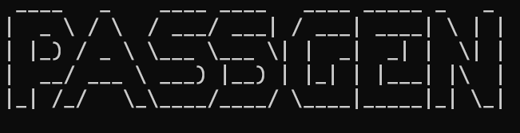

<!-- PROJECT LOGO -->
<br />
<div align="center">
  <a href="#">
    
  </a>

  <h2 align="center">ReconTool</h2>
  <p align="center">
    <a
      href="https://github.com/Shirshakhtml/passgen/issues/new?assignees=&labels=bug">Report
      Bug</a>
    ·
    <a href="https://github.com/Shirshakhtml/passgen/issues">Request Feature</a>
  </p>

  
  
  
   <br />  <br />

</div>

# Description

*A strong password generator is a tool that creates random, secure passwords that are difficult for attackers to guess. These passwords are typically created by combining upper and lowercase letters, numbers, and special characters in a random and unique way, and are often longer than the typical passwords used by most people.*

## Requirements(optional)

**Figlet :** ```pip3 install pyfiglet```

## Usage 
```
python3 passgen.py
```  
